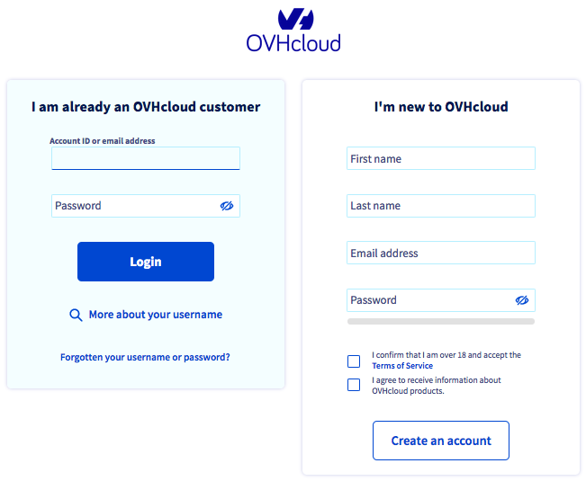

**Dernière mise à jour le 01/07/2021**

## Objectif

La gestion de vos services s'effectue principalement via l'espace client OVHcloud.

**Découvrez comment vous connecter à votre compte OVHcloud et aussi comment résoudre les échecs de connexion.**

## Prérequis

- Avoir créé [votre compte OVHcloud](https://docs.ovh.com/fr/customer/creer-compte-ovhcloud)
- Avoir consulté les [bonnes pratiques de sécurisation de votre compte OVHcloud](https://docs.ovh.com/fr/customer/tout-savoir-sur-identifiant-client/)

## En pratique

<iframe width="560" height="315" src="https://www.youtube-nocookie.com/embed/odO58c4gJfc" frameborder="0" allow="accelerometer; autoplay; clipboard-write; encrypted-media; gyroscope; picture-in-picture" allowfullscreen></iframe>

### Se connecter à l'espace client OVHcloud

Rendez-vous sur [la page d'authentification OVHcloud](https://www.ovh.com/auth/?action=gotomanager&from=https://www.ovh.com/fr/&ovhSubsidiary=fr){.external}, renseignez votre identifiant client (ou votre adresse e-mail principale) et votre mot de passe.

{.thumbnail}

Si vous avez activé la [double authentification](https://docs.ovh.com/fr/customer/securiser-son-compte-avec-une-2FA/), vous devrez alors renseigner le code unique de connexion généré par votre périphérique (téléphone, tablette ou clé U2F).

### Que faire si je ne parviens pas à me connecter ? 

La suite de ce guide vous donne des méthodes pour résoudre les cas fréquents d'échecs de connexion à l'espace client OVHcloud.

#### Je ne connais pas mon identifiant client, comment le retrouver ?

L'identifiant client OVHcloud, qui se présente sous la forme **xx11111-ovh**, vous sera invariablement demandé lorsque vous vous connecterez à votre compte ou que vous contacterez l'assistance technique d'OVHcloud. Vous pouvez le retrouver de différentes manières.

##### **Dans les e-mails envoyés par OVHcloud**

Votre identifiant client est renseigné sur l'e-mail de confirmation de création du compte, les messages de confirmation de commande ou de renouvellement, ainsi que dans les notifications de connexion à votre compte.

##### **Sur mes factures**

Votre identifiant client est renseigné en haut à droite sur toutes vos factures.

{.thumbnail}

##### **Se connecter sans identifiant**

Si vous ne retrouvez pas votre identifiant, sachez que vous pouvez vous connecter en utilisant l'adresse e-mail principale (à la place de l'identifiant)que vous avez renseignée dans votre compte.

Une fois connecté, vous pourrez prendre note de votre identifiant qui est affiché dans votre espace client, en cliquant sur votre nom en haut à droite.
 Il apparaît sous votre adresse e-mail principale.

{.thumbnail}

### J'ai perdu mon mot de passe

En cas de perte ou d'oubli de votre mot de passe, consultez [ce guide détaillant la marche à suivre pour le modifier](https://docs.ovh.com/fr/customer/gerer-son-mot-de-passe/#si-vous-ne-connaissez-plus-votre-mot-de-passe-actuel).

### J'ai perdu mon mot de passe et mon adresse e-mail principale n'est plus valide

Dans ce cas de figure, la procédure de réinitialisation du mot de passe ne peut être effectuée depuis la page de connexion.

#### Si vous avez renseigné une adresse e-mail de secours

Vous pouvez contacter le support OVHcloud au 1007 (composez le 0033 9 72 10 10 07 depuis une ligne en dehors de la France) afin que cette adresse de secours devienne l'adresse e-mail principale.

Une fois cette action effectuée, il est essentiel de [renseigner une **nouvelle** adresse e-mail de secours](https://docs.ovh.com/fr/customer/tout-savoir-sur-identifiant-client/#backup-email) dans votre compte.

#### Si vous n'avez pas renseigné d'adresse e-mail de secours ou que celle-ci est également invalide

Dans ce cas de figure, le support téléphonique OVHcloud ne pourra pas vous venir en aide.

Vous devez suivre cette [procédure](http://www.ovh.com/fr/cgi-bin/fr/procedure/procedureChangeEmail.cgi){.external} à nous adresser par courrier postal afin que votre identité soit vérifiée.
 Une fois le courrier reçu par nos services, nous procéderons alors au remplacement de votre adresse e-mail de contact si tous les justificatifs réclamés sont conformes.
 Cette procédure peut nécessiter plusieurs jours de délai, compte tenu des délais d'acheminement de votre courrier et de son traitement par nos services.

### La double authentification est active sur mon compte mais mon téléphone a été volé

Dans ce cas de figure, vous pouvez utiliser les codes de secours de la double authentification, utiliser un autre périphérique, ou désactiver la double authentification.

Consultez les démarches appropriées sur notre guide « [Sécuriser son compte OVHcloud avec la double authentification](https://docs.ovh.com/fr/customer/securiser-son-compte-avec-une-2FA/#que-faire-si-lun-de-mes-peripheriques-est-perdu-ou-cesse-de-fonctionner) ».

### Je n'ai pas activé la double authentification sur mon compte mais on me demande quand même un code

À des fins de sécurité, même si la double authentification n'est pas activée sur votre compte, un code de vérification peut vous être demandé afin de valider votre identification.

Celui-ci vous est envoyé par e-mail **sur l'adresse principale** que vous avez renseignée sur le compte.

Si vous ne retrouvez pas ce code, pensez à vérifier les dossiers « spam » / « courrier indésirable » de votre adresse e-mail.

> [!primary]
> Activer la double authentification sur votre compte vous permet de choisir le périphérique à utiliser (téléphone, tablette, smartphone, clé U2F) pour recevoir un code d'authentification.
>

## Aller plus loin

[Créer votre compte OVHcloud](https://docs.ovh.com/fr/customer/creer-compte-ovhcloud)

[Sécuriser mon compte OVHcloud et gérer mes informations personnelles](https://docs.ovh.com/fr/customer/tout-savoir-sur-identifiant-client/)

[Modifier le mot de passe de votre compte](https://docs.ovh.com/fr/customer/gerer-son-mot-de-passe/)

[Sécuriser son compte OVHcloud avec la double authentification](https://docs.ovh.com/fr/customer/securiser-son-compte-avec-une-2FA/)
