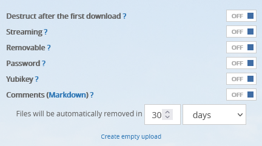

**Last updated July 3rd, 2021**

## Objective

**This guide provides some basic information on how to use [Plik](https://ca.plik.ovh/#/), some use cases for it, and the different options for sharing files.**

## Requirements

- An OVHcloud account

If you do not already have one you can create one [here](https://ca.ovh.com/auth/?action=gotomanager&from=https://www.ovh.com/world/&ovhSubsidiary=we).

## Instructions

### API Login

In order to upload files you must be authenticated. Click `Login with OVH`{.action} to begin.

Sign in with your OVHcloud account, giving the API access to the tool. Type in your credentials and click the `Log in`{.action} button to proceed.

This will bring you to the upload page.

### Uploading Files

Once logged in, you will have the ability to upload files, log out, create access tokens, or delete all uploads.

To upload a file, select the `Upload files`{.action} button. This will bring up a new page. On this page, you have many options for how to make your uploads available.

- Destruct after the first download - This option will delete your upload after the first time it is downloaded
- Streaming - The file will not be stored on the server. Instead, the file upload will begin when the remote user begins the download.
- Removable - Allows the end-user(s) to delete the file
- Password - Protect your upload with credentials
- Comments - Add comments to your upload, Markdown language is supported
- Files will be automatically removed in - Choose the number of days (30 maximum), hours or minutes that you would like your files to be automatically removed by.

> [!primary]
>
> Note: When protecting your upload with a password, the default username is plik.
>

Select the options that you wish to use and click the `Add files`{.action} button.

> [!primary]
>
> Note: Files are limited to 10 GB in size.
>

After selecting the files you wish to upload, select the green `Upload`{.action} button on the left-hand side. This will open a new page with your files attached; from here, we will go over our downloading options.

### Downloading Files

On the download page, we have new options:

- Zip archive - Puts all of the files you uploaded in a zip folder
- Add files - Add more files to this link
- Delete - Delete all files attached to this link

You may also delete files one at a time by clicking the `X`{.action} button next to the file.

To allow your end-user(s) to download your files, give them the link to the individual file located below the file name. You may also give them the link to all the files in the session by giving them the URL located in your web address bar.

## Go further

Join our community of users on <https://community.ovh.com/en/>.
