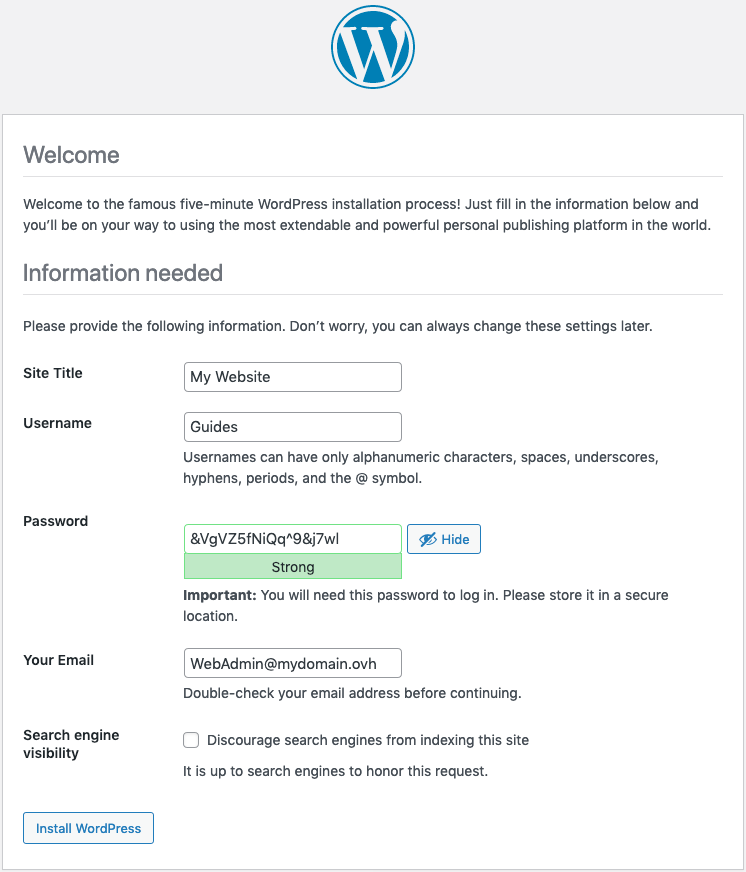

> [!primary]
> Questa traduzione è stata generata automaticamente dal nostro partner SYSTRAN. I contenuti potrebbero presentare imprecisioni, ad esempio la nomenclatura dei pulsanti o alcuni dettagli tecnici. In caso di dubbi consigliamo di fare riferimento alla versione inglese o francese della guida. Per aiutarci a migliorare questa traduzione, utilizza il pulsante "Modifica" di questa pagina.
>

**Ultimo aggiornamento: 26/07/2021**

## Obiettivo

WordPress è un sistema di gestione dei contenuti che permette di creare il tuo sito in modo semplice e veloce. Per amministrarlo non sono necessarie competenze specifiche di programmazione.

Questa guida contiene gli step di base per l'installazione manuale che comporta la configurazione di un server Web. Preconfigurare l'istanza per utilizzare WordPress selezionando il nostro template WordPress (su CentOS) durante la creazione dell'istanza.

**Questa guida ti mostra come installare WordPress su un'istanza Public Cloud.**

## Prerequisiti

- Un [progetto Public Cloud](https://www.ovhcloud.com/it/public-cloud/) nel tuo account OVHcloud.
- Avere accesso allo [Spazio Cliente OVHcloud](https://www.ovh.com/auth/?action=gotomanager&from=https://www.ovh.it/&ovhSubsidiary=it)
- Un accesso amministratore (root) alla tua istanza via SSH.

## Procedura

- Per installare tutto manualmente, segui le istruzioni qui sotto. (Se necessario, crea un'istanza ti consigliamo di consultare il [Guida agli step del Public Cloud](../primi-passi-public-cloud/).)

- Per un'installazione utilizzando il modello per WordPress, segui la [guida alla creazione dell'istanza](../primi-passi-public-cloud/) e scegli `WordPress`{.action} al passo 3 del processo, "Seleziona un'immagine". <br><br> {.thumbnail} <br> Con un'istanza di WordPress creata con successo, il software è già installato ma devi ancora configurare il database. Procedi con le istruzioni per la [configurazione di MariaDB qui sotto](#sqlconf).

### Installa il server Web

Per prima cosa, sarà necessario installare il server Web sulla tua istanza Public Cloud.

Per effettuare questa operazione, assicurati che l'istanza sia stata aggiornata correttamente:

- **Per Debian/Ubuntu**

```bash
admin@instance:~$ sudo apt-get update && sudo apt-get upgrade -y
```

- **Per Fedora/CentOS**

```bash
[admin@instance ~]$ sudo yum update && sudo yum upgrade
```

A questo punto puoi installare il server Web che preferisci. Questo esempio utilizza il server Web Apache con questi elementi:

- PHP
- PHP-MySQL
- Server MySQL o MariaDB

> [!primary]
>
> Dato che i pacchetti software vengono regolarmente aggiornati, potrebbe essere necessario adattare le seguenti istruzioni in base alle ultime versioni.
>

- **Per Debian/Ubuntu**

```bash
admin@instance:~$ sudo apt-get install apache2 php php-mysql mysql-server -y
```

- **Per Fedora/CentOS**

```bash
[admin@instance ~]$ sudo yum install httpd php php-mysqlnd mariadb-server -y
```

Ti verrà chiesto di configurare l'account "root" del database MySQL. Riavvia il server Web per assicurarti che sia stato registrato correttamente.

- **Per Debian/Ubuntu**

```bash
admin@instance:~$ sudo systemctl restart apache2
```

- **Per Fedora/CentOS**

```bash
[admin@instance ~]$ sudo systemctl restart httpd.service
```

### Telecaricare WordPress

Accedi al sito di [WordPress](https://wordpress.org/download/){.external} per recuperare il link di download dell'ultima versione. Scarica il file:

```bash
admin@instance:~$ wget https://wordpress.org/latest.tar.gz
```

Elimina l'archivio scaricato:

```bash
admin@instance:~$ tar zxvf latest.tar.gz
```

Elimina la cartella predefinita del server Web:

```bash
admin@instance:~$ sudo rm -R /var/www/html/
```

Sostituisci di default la cartella del server Web con la cartella WordPress:

```bash
admin@instance:~$ sudo mv wordpress /var/www/html
```

A questo punto puoi concedere al server Web autorizzazioni di scrittura sulla cartella.

- **Per Debian/Ubuntu**

```bash
admin@instance:~$ sudo chown -R www-data:www-data /var/www/html/
```

- **Per Fedora/CentOS**

```bash
[admin@instance ~]$ sudo chown -R apache:apache /var/www/html/
```

### Configurazione di MySQL <a name="sqlconf"></a>

A differenza di MySQL-Server che puoi installare su Debian/Ubuntu, MariaDB non configura la tua password di root durante l'installazione. Avvia il server MariaDB e configura la tua password con questi comandi.

Avvia il server del database:

```bash
[admin@instance ~]$ sudo systemctl start mariadb.service
```

Riconfigurare la password "root":

```bash
[admin@instance ~]$ sudo /usr/bin/mysql_secure_installation
```

```bash
Set root password? [Y/n] Y
New password:
```

Ti verrà inoltre chiesto di confermare alcune azioni relative alla sicurezza, come l'eliminazione dell'utente anonimo di default e la disattivazione delle connessioni root.

Le seguenti istruzioni sono valide per MySQL e MariaDB.

Una volta recuperata la password "root", accedi al tuo server di database:

```bash
admin@instance:~$ sudo mysql -u root -p
```

A questo punto puoi creare un nuovo utente, una password e un database dedicato a WordPress.

Creare un utente:

```sql
mysql> CREATE USER 'wordpress'@'localhost' IDENTIFIED BY 'Password utente';
```

Crea un database:

```sql
mysql> CREATE DATABASE `wordpress`;
```

Concedere tutti i diritti all'utente "wordpress" sul database "wordpress":

```sql
mysql> GRANT ALL PRIVILEGES ON `wordpress` . * to 'wordpress'@ localhost';
```

Chiudi la CLI del database:

```sql
mysql> exit;
```

### Configura WordPress

Una volta configurato il database, puoi avviare un browser e connetterti al sito WordPress inserendo l'indirizzo IP della tua istanza (o il dominio se ne hai [già collegato uno all'istanza](../../domains/web_hosting_modifica_la_tua_zona_dns/)).

L'assistente di configurazione WordPress ti permette di configurare gli accessi al tuo database. Inserisci i dettagli che hai definito negli step precedenti.

{.thumbnail}

Il secondo step consiste nel configurare le informazioni generali del tuo sito Internet e l'utente amministratore WordPress.

{.thumbnail}

Una volta convalidato, potrai collegarti allo spazio di amministrazione del tuo sito con l'utente appena creato.

## Per saperne di più

Contatta la nostra Community di utenti all’indirizzo <https://community.ovh.com/en/>.